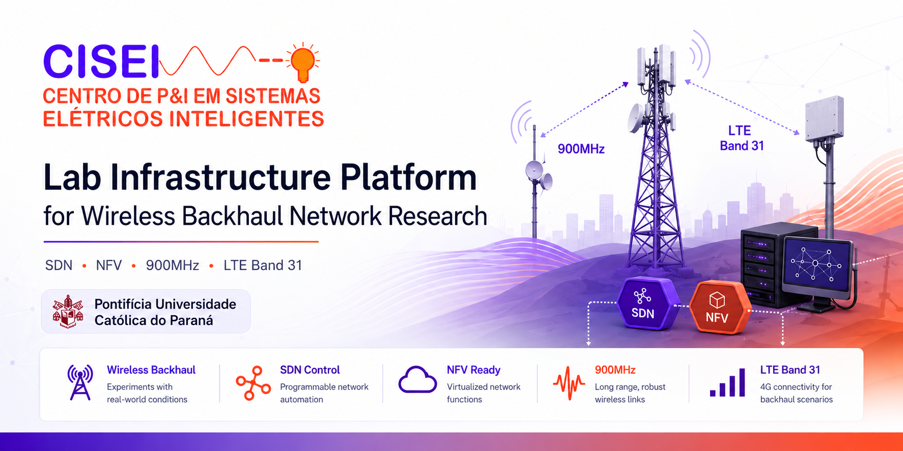
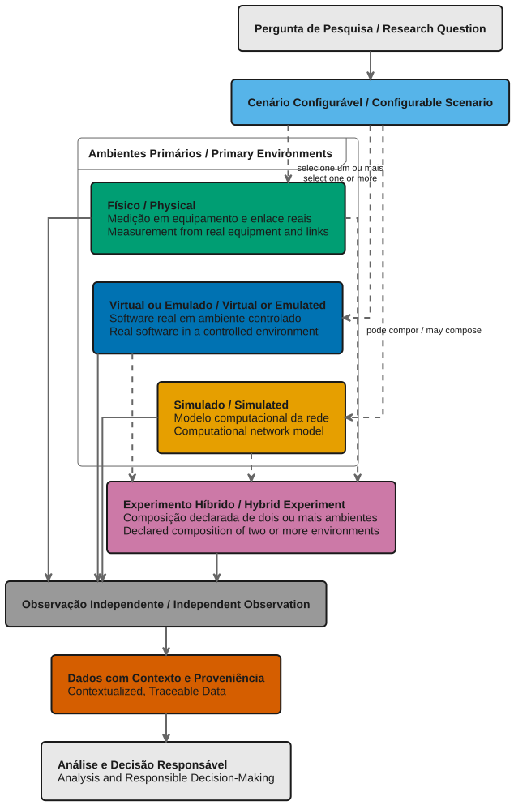

  <picture>
    <source media="(prefers-color-scheme: dark)" srcset="docs/assets/img/banner-cisei-smartgrid-lab-dark.png">
    
  </picture>

  
  
  

  
  
  
  
  
  
  
  
  
  

# CISEI SmartGrid Lab

> **PT-BR** — Plataforma de pesquisa aplicada para experimentos em cenários configuráveis, reproduzíveis e orientados por evidências em redes de comunicação para sistemas elétricos inteligentes.
>
> **EN** — An applied-research platform for experiments in configurable, reproducible, evidence-driven scenarios in communication networks for smart electric systems.

[Português](#português) · [English](#english)

## Visão da Plataforma / Platform Overview

As redes de comunicação de *backhaul* sem fio conectam ativos distribuídos aos centros de operação. Planejá-las e avaliá-las com segurança exige experimentos controlados, instrumentos de observação confiáveis e resultados cuja origem possa ser examinada e reproduzida.

Wireless backhaul networks connect distributed assets to operational centers. Planning and evaluating them safely requires controlled experiments, trustworthy observation, and results whose origin can be examined and reproduced.

  <picture>
    <source media="(prefers-color-scheme: dark)" srcset="docs/assets/img/experimental-environments-dark.svg">
    
  </picture>

Fonte: <a href="docs/assets/src/experimental-environments-light.puml">PlantUML claro</a> · <a href="docs/assets/src/experimental-environments-dark.puml">PlantUML escuro</a>

O diagrama mostra como uma pergunta de pesquisa pode se tornar um cenário configurável, sendo executada em um ou mais ambientes experimentais e produzindo observações, dados rastreáveis e análises que sustentam decisões responsáveis. Experimentos híbridos combinam explicitamente dois ou mais ambientes primários em uma mesma execução — por exemplo, equipamentos e enlaces físicos com funções virtualizadas, emulação controlada ou modelos simulados — mantendo claras as fronteiras, as interfaces e os limites de validade de cada parte do resultado.

The diagram shows how a research question becomes a configurable scenario, runs in one or more experimental environments, and produces observations, traceable data, and analysis that support responsible decisions. Hybrid experiments explicitly combine two or more primary environments in a single execution — for example, physical equipment and links with virtualized functions, controlled emulation, or simulated models — while keeping the boundaries, interfaces, and validity limits of each part of the result clear.

| Pilar / Pillar                                                                                                 | Papel na Plataforma / Role in the Platform                                                                                                                                                                                     |
| -------------------------------------------------------------------------------------------------------------- | ------------------------------------------------------------------------------------------------------------------------------------------------------------------------------------------------------------------------------ |
| Comunicações sem fio para sistemas elétricos inteligentes / Wireless communications for smart electric systems | Investiga conectividade de *backhaul* e comportamentos de rede relevantes para aplicações críticas. / Investigates backhaul connectivity and network behavior relevant to critical applications.                               |
| Infraestrutura programável / Programmable infrastructure                                                       | Explora SDN, NFV, roteamento e automação como instrumentos de experimentação. / Explores SDN, NFV, routing, and automation as experimental instruments.                                                                        |
| Observabilidade e evidência / Observability and evidence                                                       | Produz métricas, eventos, rastros e resultados com contexto experimental explícito. / Produces metrics, events, traces, and results with explicit experimental context.                                                        |
| Simulação e gêmeos digitais / Simulation and digital twins                                                     | Compara ambientes e calibra modelos contra medições quando a pergunta de pesquisa exigir. / Compares environments and calibrates models against measurement when the research question requires it.                            |
| Dados e análise / Data and analysis                                                                            | Organiza proveniência, qualidade e reutilização responsável de dados experimentais. / Organizes provenance, quality, and responsible reuse of experimental data.                                                               |
| Inteligência artificial progressiva / Progressive artificial intelligence                                      | Avalia diagnóstico, recomendação e recuperação sob limites explícitos de segurança, autorização e supervisão. / Evaluates diagnosis, recommendation, and recovery within explicit safety, authorization, and oversight limits. |

## Português

### Sobre a Plataforma

O CISEI SmartGrid Lab é uma plataforma de pesquisa aplicada, de horizonte contínuo, do CISEI/PUC-PR. Ela reúne infraestrutura física, ambientes virtualizados, simulação, emulação de tráfego, observabilidade, automação e gestão de dados para investigar redes de comunicação que sustentam sistemas elétricos inteligentes.

A plataforma transforma questões de pesquisa e problemas técnicos em cenários controlados. Cada experimento deve declarar o ambiente, a configuração pretendida, os critérios de avaliação e o contexto necessário para que seus resultados possam ser examinados e, quando aplicável, reproduzidos.

### Capacidades de Pesquisa

- Avaliação de redes de comunicação sem fio e de *backhaul* para aplicações de sistemas elétricos inteligentes.
- Experimentos físicos, virtuais, simulados e híbridos, cada qual com limites de validade explícitos.
- Perfis configuráveis de topologia, enlace, tráfego, degradação, falha, observabilidade, aceite e recuperação.
- Simulação e avaliação de sombras e gêmeos digitais calibrados por medição.
- Observabilidade, qualidade de dados, proveniência e curadoria de resultados experimentais.
- SDN, NFV, automação e inteligência artificial para diagnóstico, recomendação e recuperação progressiva sob limites de segurança e autorização.

### Para Quem

A plataforma atende pesquisadores, estudantes, equipes técnicas parceiras, profissionais de redes, observabilidade e segurança, além de gestores de pesquisa e inovação que necessitem avaliar hipóteses em um ambiente controlado.

### Escopo e Limites

O laboratório é um ambiente de pesquisa, não uma rede de produção nem uma oferta comercial. Resultados são sempre condicionados ao ambiente experimental que os originou: uma simulação não equivale automaticamente a uma medição física, e uma medição de bancada não representa automaticamente comportamento de campo.

A plataforma evolui por incrementos baseados em evidências. Recursos descritos como planejados ou em avaliação não devem ser interpretados como capacidade operacional disponível.

### Como Interpretar os Ambientes

- **Virtual**: componentes reais de software são executados em máquinas, contêineres ou redes virtualizadas.
- **Emulado**: aplicações ou protocolos reais operam sobre um comportamento de rede ou dispositivo reproduzido de forma controlada.
- **Simulado**: um modelo computacional representa o comportamento da rede; ele permite explorar escala e condições que não estão disponíveis fisicamente, mas requer calibração e limites de validade declarados.
- **Híbrido**: não é um quarto ambiente independente. É um experimento que compõe, de modo explícito, dois ou mais ambientes primários — por exemplo, equipamento físico e funções virtualizadas.

## English

### About the Platform

CISEI SmartGrid Lab is a long-lived applied-research platform of CISEI/PUC-PR. It brings together physical infrastructure, virtualized environments, simulation, traffic emulation, observability, automation, and data management to investigate communication networks that support smart electric systems.

The platform turns research questions and technical problems into controlled scenarios. Each experiment must declare its environment, intended configuration, evaluation criteria, and the context needed for its results to be examined and, where applicable, reproduced.

### Research Capabilities

- Assessment of wireless and backhaul communication networks for smart-electric-system applications.
- Physical, virtual, simulated, and hybrid experiments, each with explicit validity limits.
- Configurable profiles for topology, link behavior, traffic, degradation, failure, observability, acceptance, and recovery.
- Simulation and evaluation of digital shadows and twins calibrated with measurement.
- Observability, data quality, provenance, and curation of experimental results.
- SDN, NFV, automation, and artificial intelligence for progressive diagnosis, recommendation, and recovery within explicit safety and authorization limits.

### Who It Is for

The platform serves researchers, students, technical partners, network, observability, and security professionals, and research and innovation leaders who need to evaluate hypotheses in a controlled environment.

### Scope and Limits

The lab is a research environment, not a production network or commercial service. Results are always constrained by their experimental environment: a simulation does not automatically equal a physical measurement, and a bench measurement does not automatically represent field behavior.

The platform evolves through evidence-based increments. Resources described as planned or under evaluation must not be interpreted as available operational capability.

### How to Read the Environments

- **Virtual**: real software components run in virtual machines, containers, or virtual networks.
- **Emulated**: real applications or protocols run over controlled, reproduced network or device behavior.
- **Simulated**: a computational model represents network behavior. It allows scale and conditions that are not physically available to be explored, but requires calibration and declared validity limits.
- **Hybrid**: this is not a fourth independent environment. It is an experiment that explicitly composes two or more primary environments — for example, physical equipment and virtualized functions.

## Documentação e Referências Públicas / Public Documentation and References

| Recurso | Conteúdo |
| --- | --- |
| [Termo de Abertura da Plataforma de Pesquisa](docs/charter.md) | Propósito, tese de valor, escopo, governança e princípios de evolução da plataforma. / Purpose, value thesis, scope, governance, and evolution principles. |
| [Glossário](docs/glossary.md) | Vocabulário usado na documentação pública. / Terms used in the public documentation. |
| [Bibliografia](docs/bibliography.bib) | Registros bibliográficos que sustentam a documentação. / Bibliographic records supporting the documentation. |
| [Como citar](CITATION.cff) | Metadados de citação do registro público. / Citation metadata for the public record. |
| [Revisão de literatura e mapa de pesquisa](https://github.com/fsd-dantas/wireless-backhaul-smartgrid-review) | Revisão pública complementar, em inglês. / Complementary public literature review, in English. |

## Acesso aos Espaços Privativos / Access to Private Workspaces

Os repositórios de pesquisa e operação do laboratório são privados. O acesso é concedido mediante solicitação e triagem pelo coordenador do laboratório.

The lab's research and operational repositories are private. Access is granted through a request and review by the laboratory coordinator.

1. Abra uma [solicitação de acesso](../../issues/new?template=access-request.yml) neste repositório. / Open an [access request](../../issues/new?template=access-request.yml) in this repository.
2. Preencha todos os campos do formulário. Para estudantes, vínculo institucional, orientação e linha de pesquisa são obrigatórios. / Complete every form field. Students must provide their institutional affiliation, adviser, and intended research line.
3. A solicitação será analisada. Quando aprovada, o solicitante receberá um convite do GitHub para o repositório correspondente, e a *issue* será fechada com a decisão registrada. / The request will be reviewed. If approved, the requester will receive a GitHub invitation to the appropriate repository and the issue will be closed with the recorded decision.

> **Privacidade / Privacy:** a solicitação abre uma *issue* pública do GitHub. Envie apenas as informações pedidas no formulário; não inclua documentos, telefones, credenciais, dados de rede, dados de pesquisa não publicados ou qualquer outra informação sensível. The request opens a public GitHub issue. Submit only the requested information; do not include documents, phone numbers, credentials, network details, unpublished research data, or any other sensitive information.

### Elegibilidade / Eligibility

- Estudantes de pós-graduação e iniciação científica da PUC-PR com orientador(a) vinculado(a) ao laboratório. / PUC-PR graduate and undergraduate research students with an adviser affiliated with the lab.
- Docentes e pesquisadores da PUC-PR. / PUC-PR faculty members and researchers.
- Parceiros externos, mediante acordo institucional prévio. / External partners, subject to a prior institutional agreement.

## Citação, Licença e Uso Responsável / Citation, License, and Responsible Use

Use [CITATION.cff](CITATION.cff) para citar o registro público. Salvo indicação diferente no próprio arquivo, a documentação pública é licenciada sob [CC BY 4.0](LICENSE-DOCS.md).

Use [CITATION.cff](CITATION.cff) to cite the public record. Unless a file states otherwise, the public documentation is licensed under [CC BY 4.0](LICENSE-DOCS.md).

Marcas, materiais de terceiros, credenciais, topologias de campo, endereçamento, identificação de equipamentos e dados operacionais não sanitizados não são conteúdo público. Consulte o [NOTICE](NOTICE) para atribuições e exclusões.

Trademarks, third-party materials, credentials, field topology, addressing, equipment identification, and unsanitized operational data are not public content. See the [NOTICE](NOTICE) for attributions and exclusions.
