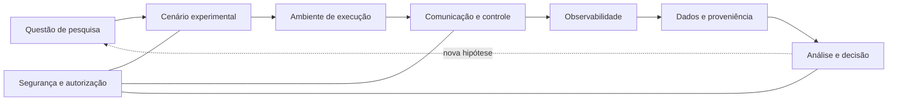

# Base de Conhecimento — CISEI SmartGrid Lab

> Fundamentos para compreender os conceitos científicos e de engenharia
> investigados no laboratório.

Esta base de conhecimento explica **por que** os elementos da plataforma existem,
como se relacionam e quais limites devem ser considerados ao interpretar um
experimento. Ela complementa o [Termo de Abertura](../charter.md): o termo define a
identidade e a direção da plataforma; estas páginas desenvolvem os fundamentos que
sustentam seu trabalho.

## Mapa dos conceitos

O fluxo não afirma que todo experimento precise de inteligência artificial ou de
uma rede programável. Ele mostra a cadeia mínima que permite ligar uma pergunta a
uma conclusão: declarar condições, executar, observar, preservar o contexto e
interpretar o resultado dentro de seus limites de validade.

## Trilhas de leitura

### Começar pelo problema

1. [Comunicações para sistemas elétricos inteligentes](foundations/smart-grid-communications.md)
2. [Da pergunta de pesquisa à evidência](experimentation/research-question-to-evidence.md)
3. [Ambientes físicos, virtuais, emulados e simulados](experimentation/experimental-environments.md)

### Entender a infraestrutura de comunicação

1. [Qualidade de rede: atraso, variação, perda e disponibilidade](networking/network-quality.md)
2. [Infraestrutura programável: SDN, NFV e automação](networking/programmable-infrastructure.md)
3. [LTE privada como rede de missão crítica](networking/private-lte.md)

### Entender dados, confiança e decisão

1. [Observabilidade, qualidade de dados e proveniência](data-and-evidence/observability-and-provenance.md)
2. [Segurança em experimentos de tecnologia operacional](security/defense-in-depth.md)
3. [Automação progressiva e autonomia responsável](intelligence/progressive-autonomy.md)

## Como ler estas páginas

Cada artigo separa quatro perguntas:

- **Conceito:** qual é a ideia e qual problema ela resolve?
- **Relações:** de quais outros conceitos ela depende?
- **Aplicação no laboratório:** como a ideia orienta a pesquisa, sem expor a
  configuração operacional?
- **Limites:** o que um resultado permite — e não permite — concluir?

As páginas não constituem procedimentos operacionais, inventário ou declaração de
capacidade disponível. Recursos planejados são distinguidos de recursos observados,
e exemplos de rede são deliberadamente genéricos.

## Escopo editorial

O conteúdo público pode explicar arquiteturas, modelos, métricas, protocolos,
métodos experimentais e referências científicas. Não deve incluir credenciais,
endereçamento, identificadores de segmentos de rede, nomes de equipamentos ou
*hosts*, topologias de campo, dados não publicados ou informações de parceiros.

Consulte [Como contribuir](CONTRIBUTING.md) antes de propor um artigo. Termos e
siglas usados aqui seguem o [glossário público](../glossary.md); as referências
bibliográficas são mantidas em [`bibliography.bib`](../bibliography.bib).

## Estado da coleção

Esta é a edição fundacional da base. Os primeiros artigos estabelecem o vocabulário
e as relações entre os principais domínios. Novas páginas devem aprofundar um
conceito sem duplicar o Termo de Abertura, o glossário ou documentos operacionais.
