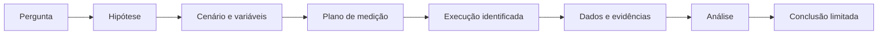

# Da pergunta de pesquisa à evidência

> Um experimento liga uma pergunta a uma conclusão por meio de condições declaradas,
> observações rastreáveis e critérios definidos antes da interpretação dos dados.

## A cadeia experimental

Cada ligação precisa ser examinável. Se a configuração efetiva não pode ser
associada à execução, ou se os dados não podem ser associados ao instrumento e ao
instante de coleta, a cadeia perde força mesmo que os gráficos pareçam convincentes.

## Pergunta, hipótese e variáveis

Uma pergunta de pesquisa delimita o fenômeno. A hipótese formula uma expectativa
que pode ser confrontada com observações. O desenho distingue:

- **variáveis independentes**, manipuladas ou selecionadas;
- **variáveis dependentes**, observadas como possíveis efeitos;
- **variáveis controladas**, mantidas constantes ou registradas;
- **fatores de confusão**, capazes de oferecer outra explicação para o resultado.

Por exemplo, comparar duas políticas de encaminhamento exige controlar ou registrar
carga, topologia, condições do enlace, versão dos componentes e estado inicial.
Caso contrário, uma diferença atribuída à política pode ter sido causada por outra
mudança.

## Cenário, perfis e descritor

O **cenário** representa as condições relevantes do sistema sob estudo. Perfis
reutilizáveis podem descrever aspectos como topologia, enlace, tráfego, falha e
observação. Um **descritor de experimento** compõe esses perfis e acrescenta o que é
específico de uma execução planejada: hipótese, fatores, métricas, critérios,
ambiente, repetição e método de coleta.

Essa separação reduz ambiguidade. Dois experimentos podem reutilizar uma topologia
e variar apenas o perfil de tráfego; ou usar a mesma hipótese em ambientes
diferentes para estudar a validade externa.

## Métricas e critérios

Uma métrica define como uma propriedade será quantificada. Um indicador-chave de
desempenho seleciona uma métrica relevante para a pergunta. Um critério de aceitação
acrescenta uma regra de decisão, incluindo limite, população, janela e condições.

“Medir atraso” é insuficiente. É preciso declarar, por exemplo, os pontos de início
e fim, relógios usados, direção do fluxo, unidade, agregação, percentil e tratamento
de amostras ausentes. Critérios definidos depois de observar o resultado aumentam o
risco de selecionar uma interpretação conveniente.

## Identidade e proveniência

Uma execução deve possuir identidade própria. A evidência associa essa identidade
à configuração declarada e efetiva, versões de software ou modelos, ambiente,
instrumentos, operador ou processo responsável, dados brutos, transformações e
resultado derivado. Hashes ajudam a detectar alteração, mas não substituem contexto:
um arquivo íntegro ainda pode ter origem desconhecida ou método inadequado.

## Repetição, reprodução e replicação

O vocabulário varia entre disciplinas, portanto cada trabalho deve declarar as
definições adotadas. Nesta base:

- **repetição** executa novamente o procedimento sob condições essencialmente
  iguais;
- **reprodução** obtém um resultado compatível a partir da descrição e dos
  artefatos disponibilizados;
- **replicação** testa a conclusão com implementação, equipe ou ambiente
  suficientemente independentes.

Nenhuma delas significa obter números idênticos. O objetivo é avaliar se o efeito
permanece dentro da incerteza e das condições declaradas.

## Relação com a plataforma

A plataforma busca tornar explícita a passagem da pergunta ao cenário e do cenário
à evidência. Isso não automatiza o método científico: escolhas de hipótese,
controle, amostragem e interpretação continuam exigindo julgamento do pesquisador.
A automação reduz variação acidental e preserva registros; ela não transforma um
desenho fraco em experimento válido.

## Conceitos relacionados

- [Ambientes experimentais](experimental-environments.md)
- [Observabilidade e proveniência](../data-and-evidence/observability-and-provenance.md)
- [Automação progressiva](../intelligence/progressive-autonomy.md)

## Referências

Consulte as entradas `OECDFrascati2015`, `ISO17025`, `Wilkinson2016`,
`W3CPROVDM`, `PowderComnet2021` e `PosCoNEXT2021` em
[`bibliography.bib`](../../bibliography.bib).
