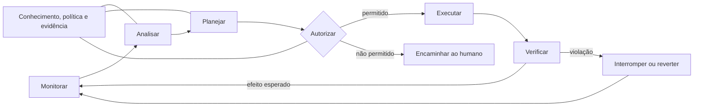

# Automação progressiva e autonomia responsável

> Autonomia é uma capacidade avaliada por tarefa e cenário: observar, recomendar ou
> executar são níveis de autoridade diferentes e exigem evidências diferentes.

## Da automação à autonomia

Automação executa uma regra ou procedimento sem repetir intervenção manual em cada
passo. Autonomia acrescenta capacidade de perceber contexto, selecionar ações e
adaptar comportamento em direção a um objetivo. A fronteira não é absoluta: sistemas
reais combinam partes manuais, determinísticas, orientadas por política e aprendidas.

Não é útil atribuir um único “nível de autonomia” à plataforma inteira. Uma função
pode diagnosticar automaticamente e apenas recomendar uma correção; outra pode
executar uma ação reversível dentro de limites estreitos; uma terceira pode exigir
operação inteiramente manual. A avaliação deve ser feita por caso de uso, ambiente e
classe de mudança.

## Um laço orientado por conhecimento

O modelo MAPE-K organiza sistemas autonômicos em monitorar, analisar, planejar e
executar, apoiados por conhecimento compartilhado. Para pesquisa responsável, é útil
explicitar ainda autorização, verificação e reversão:

O “conhecimento” inclui topologia, estado observado, modelos, políticas, histórico e
incerteza. Se essas fontes estão desatualizadas ou contraditórias, a decisão deve
reduzir sua autoridade ou solicitar revisão.

## Funções possíveis da inteligência artificial

Modelos estatísticos e de aprendizado podem apoiar:

- detecção de anomalias em telemetria;
- classificação ou localização provável de falhas;
- previsão de demanda, qualidade de enlace ou risco;
- recomendação de configuração;
- seleção de política sob condições conhecidas;
- interpretação assistida de registros e documentação.

Um modelo de linguagem pode propor uma mudança plausível sem compreender todas as
restrições do ambiente. Plausibilidade textual não é correção operacional. Saídas
devem ser convertidas em artefatos estruturados, avaliadas por regras independentes
e testadas antes de receber autoridade de execução.

## Evidência para ampliar autoridade

A promoção de uma função pode seguir uma sequência como: observação, recomendação,
planejamento em ambiente isolado, execução aprovada, execução limitada e execução
mais ampla. A transição depende de evidência, não apenas de maturidade cronológica.

Critérios relevantes incluem precisão e cobertura, taxa e gravidade de falsos
positivos e negativos, calibração da incerteza, comportamento fora da distribuição,
tempo de decisão, explicabilidade suficiente ao operador, capacidade de interrupção,
reversão e ausência de regressão em funções vizinhas.

## Barreiras de segurança

- política independente do modelo que define ações permitidas;
- menor privilégio para identidades de automação;
- limite de taxa, alcance e duração da mudança;
- simulação, emulação ou validação formal quando apropriadas;
- aprovação humana para classes de maior impacto;
- telemetria independente do executor;
- condição de parada e caminho de recuperação conhecidos;
- preservação da proposta, decisão, execução e efeito como evidência.

Supervisão humana não é garantia automática: sobrecarga, viés de automação e falta de
tempo podem tornar a aprovação apenas formal. A interface deve fornecer contexto e
tempo compatíveis com a responsabilidade atribuída.

## Relação com a plataforma

A plataforma investiga IA primeiro como instrumento de análise e apoio à decisão. A
autoridade pode crescer somente em casos delimitados e após demonstração de
segurança, eficácia e reversibilidade. IA não é requisito para que um experimento de
rede seja válido e autonomia máxima não é um objetivo em si.

## Conceitos relacionados

- [Infraestrutura programável](../networking/programmable-infrastructure.md)
- [Segurança em tecnologia operacional](../security/defense-in-depth.md)
- [Observabilidade e proveniência](../data-and-evidence/observability-and-provenance.md)

## Referências

Consulte `Kephart2003`, `NISTAIRMF2023`, `FeamsterRexford2018`, `TS28100`,
`TMFAN`, `ZSM009` e `Cornetto2026` em
[`bibliography.bib`](../../bibliography.bib).
