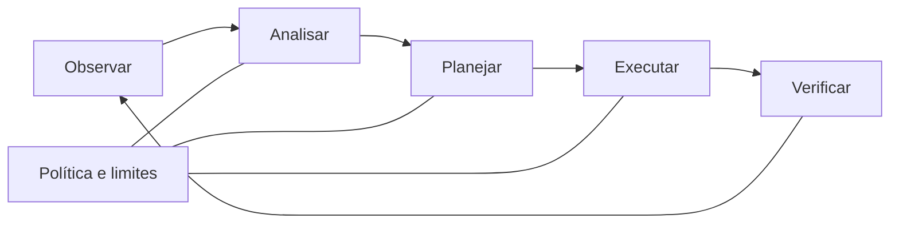

# Infraestrutura programável: SDN, NFV e automação

> Programabilidade transforma configuração e comportamento de rede em artefatos
> declarados, verificáveis e repetíveis, mas também amplia o impacto de erros.

## SDN: separar decisão e encaminhamento

Redes definidas por software (SDN) tornam explícita a separação lógica entre:

- **plano de dados**, que encaminha pacotes;
- **plano de controle**, que calcula ou instala o comportamento de encaminhamento;
- **plano de gestão**, que configura, observa e governa o sistema.

A separação é lógica, não necessariamente física. Um controlador pode oferecer uma
visão centralizada sem ser um processo único, e dispositivos tradicionais também
podem participar de uma arquitetura programável. Interfaces ao sul conectam o
controle aos dispositivos; interfaces ao norte expõem capacidades a aplicações e
políticas.

Uma visão global facilita engenharia de tráfego, experimentos controlados e
verificação de política. Em contrapartida, consistência, convergência, disponibilidade
do controle e proteção das interfaces tornam-se preocupações centrais.

## NFV: funções desacopladas de aparelhos

Virtualização de funções de rede (NFV) executa funções como roteamento, filtragem ou
inspeção em recursos computacionais generalizáveis. Isso permite instanciar,
encadear e substituir funções com flexibilidade. O desempenho, porém, passa a
depender também de escalonamento, virtualização de entrada e saída, afinidade de CPU,
memória e comportamento do hospedeiro.

SDN e NFV são complementares, mas independentes: pode haver controle programável
sobre equipamentos físicos, ou funções virtualizadas controladas por mecanismos
convencionais.

## Infraestrutura como código

Infraestrutura como código (IaC) representa o estado pretendido em arquivos
versionados e aplica mudanças por ferramentas reproduzíveis. Três propriedades são
especialmente importantes em laboratório:

- **revisabilidade:** a intenção pode ser examinada antes da aplicação;
- **idempotência:** reaplicar a mesma declaração converge para o mesmo estado;
- **rastreabilidade:** a configuração pode ser associada a uma revisão e execução.

Código declarativo não garante que o estado real corresponda à intenção. Deriva de
configuração, dependências externas e falhas parciais exigem observação e
reconciliação.

## Laços de controle

Automação de rede pode ser organizada como um laço:

Quanto mais curta a distância entre decisão e execução, maior a necessidade de
políticas, autorização, teste prévio, limite de impacto e reversão. Uma automação
rápida também pode propagar rapidamente uma premissa errada.

## Relação com a plataforma

Programabilidade permite repetir cenários, variar um fator de cada vez e registrar
a intenção de mudança. Na plataforma, ela é instrumento experimental e objeto de
pesquisa. Uma conclusão deve distinguir desempenho da política, do controlador, do
dispositivo e do ambiente computacional.

## Limites de interpretação

- “Centralizado” não significa ausência de redundância ou distribuição.
- Uma implantação virtual não é automaticamente portátil entre hospedeiros.
- Idempotência da ferramenta não prova equivalência completa do estado da rede.
- Uma política validada em topologia limitada pode falhar quando escala ou
  concorrência mudam.

## Conceitos relacionados

- [Qualidade de rede](network-quality.md)
- [Automação progressiva](../intelligence/progressive-autonomy.md)
- [Segurança em tecnologia operacional](../security/defense-in-depth.md)

## Referências

Consulte `FeamsterRexford2018`, `Kephart2003`, `ETSIzsm`, `ZSM009` e
`FABRIC2019` em [`bibliography.bib`](../../bibliography.bib).
